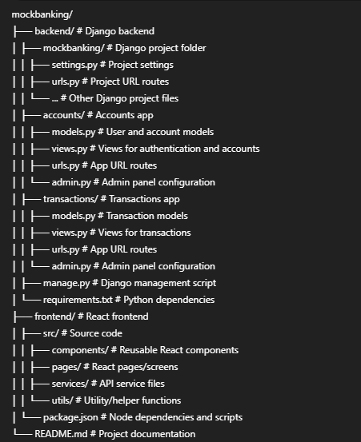

# Mock Banking Application

A full-stack banking application built with **Django** (backend) and **React** (frontend).  
Supports user authentication, account management, money transfers, and transaction history.

---

## Table of Contents

- [Features](#features)  
- [Project Structure](#project-structure)  
- [Technologies](#technologies)  
- [Setup Instructions](#setup-instructions)  
- [Usage](#usage)  
- [Admin Access](#admin-access)  
- [API Endpoints](#api-endpoints)  

---

## Features

- **User Authentication**: Register, login, JWT-based authentication.  
- **Accounts**: View balance and account details.  
- **Transactions**:  
  - Transfer money to other users.  
  - View transaction history with search and filters.  
  - Track total credits, debits, and balance updates.  
- **Frontend**: React + Tailwind CSS for a responsive UI.  
- **Backend**: Django REST Framework (DRF) APIs with pagination.  
- **Admin Panel**:  
  - Superuser can view all users and transactions.  
  - Filter, search, and manage data.

---

## Project Structure

---

## Technologies

- **Backend**: Python, Django, Django REST Framework, PostgreSQL/SQLite  
- **Frontend**: React, Tailwind CSS, Axios  
- **Authentication**: JWT (access & refresh tokens)  

---

## Setup Instructions

## Backend Setup

1. Navigate to the backend folder:
   - `cd backend`

2. Create a virtual environment:
   - `python -m venv venv`

3. Activate the virtual environment:
   - On Linux/Mac: `source venv/bin/activate`
   - On Windows: `venv\Scripts\activate`

4. Install the required dependencies:
   - `pip install -r requirements.txt`

5. Apply database migrations:
   - `python manage.py migrate`

6. Create a superuser account for admin access:
   - `python manage.py createsuperuser`

7. Run the backend server:
   - `python manage.py runserver`

---

## Frontend Setup

1. Navigate to the frontend folder:
   - `cd frontend`

2. Install frontend dependencies:
   - `npm install`

3. Start the React development server:
   - `npm start`

# Usage

## User Access

1. **Register / Login**  
   - Use the frontend React app to create a new account or log in.

2. **Account Features**  
   - View your account balance.  
   - Transfer money to other users.  
   - View your transaction history.  
   - Search and filter transactions by description or account number.  
   - Load more transactions using pagination.

---

## Admin Access

1. Open the Django admin panel at: [http://127.0.0.1:8000/admin/](http://127.0.0.1:8000/admin/)  
2. Log in using your superuser credentials.  
3. Manage the following:

   - **Users:** view, search, and filter.  
   - **Transactions:** view all transactions, search, and filter.

---

## API Endpoints

### Authentication

| Endpoint           | Method | Description                  |
|------------------|--------|------------------------------|
| `/auth/register/` | POST   | Register a new user           |
| `/auth/login/`    | POST   | Login user & get JWT tokens   |
| `/auth/profile/`  | GET    | Get current user profile      |
| `/auth/token/refresh/` | POST | Refresh access token       |

### Accounts

| Endpoint           | Method | Description                  |
|------------------|--------|------------------------------|
| `/auth/balance/`  | GET    | Get user account balance      |
| `/auth/transfer/` | POST   | Transfer money to another user |

### Transactions

| Endpoint                     | Method | Description                                |
|-------------------------------|--------|--------------------------------------------|
| `/transactions/`             | GET    | Get paginated transaction history          |
| `/transactions/`             | POST   | Create a new transaction                   |
| `/transactions/<id>/`        | GET    | Get details of a specific transaction     |
| `/transactions/<id>/`        | PUT    | Update a transaction (manual only)        |
| `/transactions/<id>/`        | DELETE | Delete a transaction (manual only)        |
| `/transactions/stats/`       | GET    | Get transaction statistics                 |
